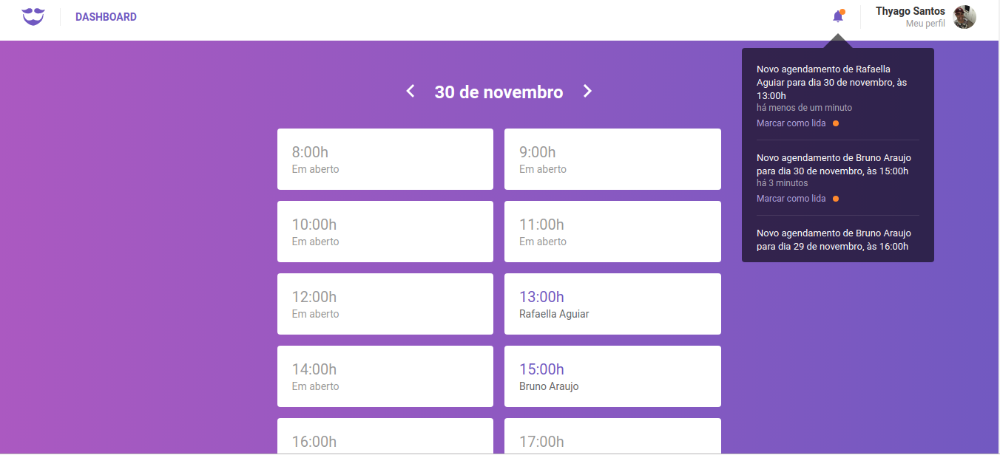
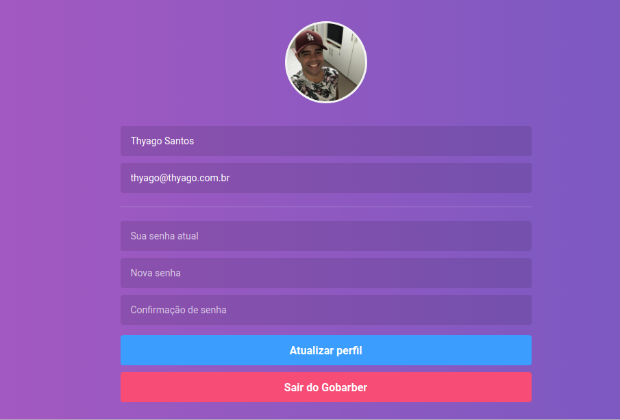

# GoBarber - Web

:scissors: A barber scheduling app that shows to the barber his agenda for the day.

### Demo







## :rocket: Technologies

This project was developed with the following technologies:

- [ReactJS](https://reactjs.org/)
- [Redux](https://redux.js.org/)
- [Redux-Saga](https://redux-saga.js.org/)
- [React Router v4](https://github.com/ReactTraining/react-router)
- [styled-components](https://www.styled-components.com/)
- [Axios](https://github.com/axios/axios)
- [History](https://www.npmjs.com/package/history)
- [Immer](https://github.com/immerjs/immer)
- [Polished](https://polished.js.org/)
- [React-Toastify](https://fkhadra.github.io/react-toastify/)
- [React-Icons](http://react-icons.github.io/react-icons/)
- [react-perfect-scrollbar](https://github.com/OpusCapita/react-perfect-scrollbar)
- [Unform](https://github.com/Rocketseat/unform)
- [Yup](https://www.npmjs.com/package/yup)
- [date-fns](https://date-fns.org/)
- [Reactotron](https://infinite.red/reactotron)
- VS Code with EditorConfig and ESLint

## :information_source: How To Use

```bash
# Clone this repository
$ git clone https://github.com/thyagoaraujo/gobarber-web.git

# Go into the repository
$ cd gobarber-web

# Install dependencies
$ yarn install

# Run the app
$ yarn start
```

## :memo: License

This project is under the MIT license. See the [LICENSE](https://github.com/thyagoaraujo/gobarber-web/blob/master/LICENSE.md) for more information.

---

## Version Mobile and API

https://github.com/thyagoaraujo/gobarber-mobile

https://github.com/thyagoaraujo/gobarber

Made with ♥ by Thyago Araujo :wave: [Get in touch!](https://www.linkedin.com/in/thyagosantosaraujo/)
